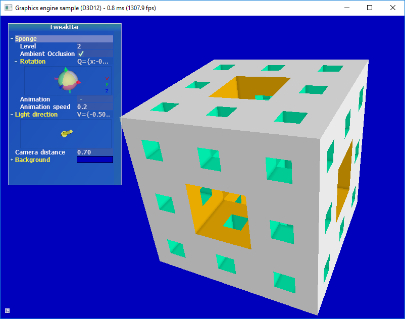
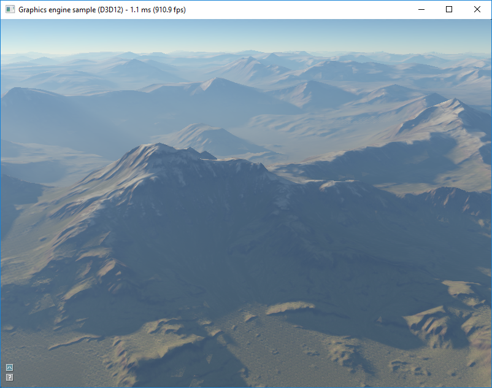

# DiligentSamples

This module contains simple graphics applications intended to demonstrate the usage of the Diligent Engine API.

## AntTweakBar Sample

This sample demonstrates how to use [AntTweakBar library](http://anttweakbar.sourceforge.net/doc) to create simple user interface. 
It can also be thought of as Diligent Engine’s “Hello World” example. 

## Atmospheric Light Scattering sample

The sample demonstrates how Diligent Engine can be used to implement various rendering tasks: 
loading textures from files, using complex shaders, rendering to textures, using compute shaders 
and unordered access views, etc.

# Build and Run Instructions

## Windows Desktop

Please visit [this page](http://diligentgraphics.com/diligent-engine/getting-started/#Build-Windows) for build instructions.

To run a sample from Visual Studio, locate the sample’s project in the solution explorer, go to 
Project->Properties->Debugging and set Working Directory to $(AssetsPath) (This variable is defined in the 
EngineRoot.props property page file located in the sample’s build\Windows.Shared folder). Then set the project as 
startup project and run it. By default the sample will run in D3D11 mode. To use D3D12 or OpenGL, use the following command 
line option: mode={D3D11|D3D12|GL} (do not use spaces!).

To run a sample from windows explorer or command line, navigate to the sample’s build/Win32 folder and execute the 
appropriate run_*.bat file (you need to build the corresponding configuration first). Do not execute run.bat!

### Build Specifics

Win32 samples dynamically link with the engine. The dlls are included into the sample’s solution and are copied to 
the sample’s output folder using the custom build tool.

## Universal Windows Platform

Please visit [this page](http://diligentgraphics.com/diligent-engine/getting-started/#Build-Windows-Store) for build instructions.

To run a sample from Visual Studio, locate the sample’s project under Samples folder in the solution explorer, 
set the project as startup project, deploy and run it. On Universal Windows Platform, only D3D11 or D3D12 mode 
is available.

## Android

Please visit [this page](http://diligentgraphics.com/diligent-engine/getting-started/#Build-Android) for build instructions.

If you are building the sample using  Visual GDB plugin for Visual Studio, you can run the sample directly from the IDE. 
You first need to go to project debugging settings and make sure that Debugger to launch is set to Local Windows Debugger. 
If you are building the sample using the command line, you can use Android tools to deploy the project to device and run it.

Android-19 or later is required to run the samples.

# Version History

## v2.1

## v2.0.alpha

## v1.0.0

Initial release

# License

Licensed under the [Apache License, Version 2.0](License.txt)

**Copyright 2015-2016 Egor Yusov**